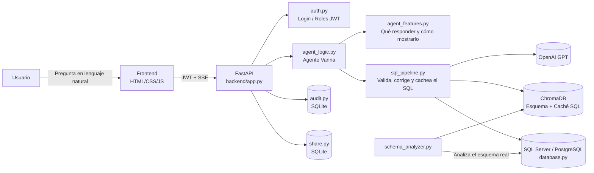

# TIARA — Agente de IA para Análisis de Datos

TIARA es una aplicación web que traduce preguntas de negocio en lenguaje natural (por ejemplo, *"¿Por qué no alcanzamos nuestro objetivo de margen neto este mes?"*) en consultas SQL, las ejecuta contra la base de datos de la empresa y devuelve la respuesta como texto, tabla y/o gráfico — todo en streaming, en tiempo real.

El agente **no depende de un esquema fijo**: al arrancar analiza la base de datos real (tablas de hechos/dimensiones, relaciones, tipos de columna) y genera su propio contexto, por lo que puede adaptarse a distintas bases de datos de clientes sin cambios de código.

## Tabla de Contenidos
- [Características](#características)
- [Arquitectura](#arquitectura)
- [Estructura del Proyecto](#estructura-del-proyecto)
- [Requisitos Previos](#requisitos-previos)
- [Instalación y Configuración](#instalación-y-configuración)
- [Variables de Entorno](#variables-de-entorno)
- [Ejecución en Local](#ejecución-en-local)
- [Despliegue](#despliegue)
- [Roles y Autenticación](#roles-y-autenticación)
- [Endpoints Principales](#endpoints-principales)
- [Licencia](#licencia)

## Características

- **Consultas en lenguaje natural:** convierte preguntas de negocio en SQL usando modelos GPT, validando que el resultado sea seguro y coherente antes de ejecutarlo.
- **Autonomía de esquema:** analiza la base de datos real al arrancar (SQL Server o PostgreSQL) y detecta tablas de hechos, dimensiones, tabla de tiempo y relaciones combinables — sin necesidad de mapeos escritos a mano.
- **RAG con ChromaDB:** el esquema y las preguntas/respuestas previas se indexan como vectores para dar contexto al LLM y cachear consultas ya resueltas.
- **Streaming en tiempo real:** las respuestas (texto, tablas y gráficos) se transmiten al frontend vía Server-Sent Events (SSE) token a token.
- **Visualización de datos:** genera gráficos (Plotly) a partir de los resultados de la consulta cuando la pregunta lo amerita.
- **Roles de usuario:** cuentas `admin` (acceso a panel de administración y métricas) y `user` (solo chat), gestionadas con JWT.
- **Panel de administración:** inspección y edición de la caché de SQL, del vector store del esquema y de los logs de auditoría.
- **Auditoría:** cada pregunta queda registrada (usuario, intención, duración, éxito/reintento) para trazabilidad.
- **Compartir resultados:** genera enlaces temporales (expiran a las 2 horas) para compartir una respuesta sin dar acceso al chat completo.

## Arquitectura



El flujo típico es: el usuario pregunta → el agente decide si necesita SQL → `sql_pipeline.py` genera, valida y cachea la consulta usando el contexto del esquema real → se ejecuta contra la base de datos → `agent_features.py` decide si el resultado se muestra como texto, tabla o gráfico → todo se transmite al frontend por streaming.

## Estructura del Proyecto
```
├── backend/
│   ├── __init__.py
│   ├── admin.py             # Endpoints del panel de administración (caché SQL, esquema, logs)
│   ├── agent_features.py    # Qué responde el agente y cómo se muestra (narrativa, gráficos)
│   ├── agent_logic.py       # Construcción del agente Vanna (LLM + herramientas + prompts)
│   ├── agent_state.py       # Estado compartido entre módulos (schema store, SQL runner, caché)
│   ├── app.py                # API FastAPI: rutas, autenticación, streaming SSE del chat
│   ├── audit.py              # Registro de auditoría de preguntas/respuestas (SQLite)
│   ├── auth.py               # Login, JWT y control de roles (admin/user)
│   ├── database.py           # Conexión y ejecución de consultas contra la base de datos
│   ├── ingest_schema.py       # Ingesta el esquema de la BD al vector store (ChromaDB)
│   ├── schema_analyzer.py    # Analiza el esquema real de la BD y genera contexto dinámico
│   ├── schema_store.py       # Vector store (ChromaDB) con el conocimiento del esquema
│   ├── share.py               # Enlaces para compartir resultados (expiran a las 2h)
│   └── sql_pipeline.py        # Valida, corrige y cachea el SQL antes de ejecutarlo
├── frontend/
│   ├── index.html             # Chat principal
│   ├── login.html             # Pantalla de login
│   ├── admin.html             # Panel de administración
│   ├── shared.html            # Vista de resultados compartidos
│   └── static/
│       ├── css/                # Estilos (chat, sidebar, admin, shared)
│       ├── js/                  # Lógica de frontend (chat.js, sidebar.js, admin.js, shared.js)
│       └── img/                 # Recursos gráficos
├── Dockerfile                  # Imagen de despliegue (incluye driver ODBC de SQL Server)
├── Procfile                    # Comando de arranque para Render (gunicorn + worker uvicorn)
├── requirements.txt            # Dependencias de Python
└── .env.example                # Plantilla de variables de entorno
```

## Requisitos Previos
- Python 3.11+
- Acceso a una base de datos SQL Server (o PostgreSQL) con el esquema que se quiere consultar
- Una API key de OpenAI
- Driver ODBC de SQL Server instalado localmente si no se usa Docker ([msodbcsql18](https://learn.microsoft.com/sql/connect/odbc/download-odbc-driver-for-sql-server))

## Instalación y Configuración

```bash
# Clonar el repositorio
git clone <url-del-repositorio>
cd TIARA_PROJECT

# Crear y activar entorno virtual
python -m venv .venv
.venv\Scripts\activate      # Windows
source .venv/bin/activate   # Linux/Mac

# Instalar dependencias
pip install -r requirements.txt

# Configurar variables de entorno
cp .env.example .env
# Editar .env con tus credenciales (ver siguiente sección)
```

## Variables de Entorno

| Variable | Descripción |
|---|---|
| `OPENAI_API_KEY` | API key de OpenAI usada para generar y razonar SQL |
| `OPENAI_MODEL` | Modelo de OpenAI a utilizar (p. ej. `gpt-4o`) |
| `SQLSERVER_ODBC` | Cadena de conexión ODBC a la base de datos |
| `CHROMA_COLLECTION` | Nombre de la colección de ChromaDB para la caché de SQL |
| `SCHEMA_COLLECTION` | Nombre de la colección de ChromaDB para el esquema |
| `ADMIN_USERNAME` / `ADMIN_PASSWORD` | Credenciales de la cuenta con rol `admin` |
| `USER_USERNAME` / `USER_PASSWORD` | Credenciales opcionales de una cuenta con rol `user` (sin acceso al panel de administración) |
| `JWT_SECRET` | Secreto usado para firmar los tokens JWT |
| `JWT_EXPIRY_HOURS` | Horas de validez del token de sesión |

## Ejecución en Local

```bash
uvicorn backend.app:app --reload --port 8000
```

La aplicación quedará disponible en `http://localhost:8000` (chat en `/`, login en `/login`, panel de administración en `/admin`).

## Despliegue

El proyecto incluye un `Dockerfile` (con el driver ODBC de SQL Server ya instalado) y un `Procfile` listo para plataformas tipo Render/Heroku:

```bash
docker build -t tiara .
docker run -p 8000:8000 --env-file .env tiara
```

En Render, el `Procfile` define el comando de arranque (`gunicorn` con worker de `uvicorn`); solo es necesario configurar las variables de entorno del servicio.

## Roles y Autenticación

La autenticación usa JWT (`backend/auth.py`). Existen dos roles:

- **admin**: acceso al chat y al panel de administración (`/admin`) — caché de SQL, vector store del esquema y métricas de auditoría.
- **user**: acceso únicamente al chat, sin panel de administración.

## Endpoints Principales

| Método | Ruta | Descripción |
|---|---|---|
| `POST` | `/api/auth/login` | Autentica y devuelve un JWT |
| `GET` | `/api/auth/me` | Datos del usuario autenticado |
| `POST` | `/api/tiara/chat_stream` | Envía una pregunta y recibe la respuesta en streaming (SSE) |
| `DELETE` | `/api/tiara/conversations/{id}` | Elimina una conversación |
| `POST` | `/api/tiara/share` | Genera un enlace temporal para compartir un resultado |
| `GET` | `/api/tiara/share/{id}` | Obtiene un resultado compartido |
| `GET` | `/api/admin/sql-cache` | Lista la caché de preguntas → SQL (solo admin) |
| `GET` | `/api/admin/schema-store` | Lista el conocimiento del esquema indexado (solo admin) |
| `GET` | `/api/admin/logs/summary` | Resumen de auditoría (solo admin) |
| `GET` | `/api/health` | Estado del servicio |

## Licencia

Software propietario. Todos los derechos reservados.
